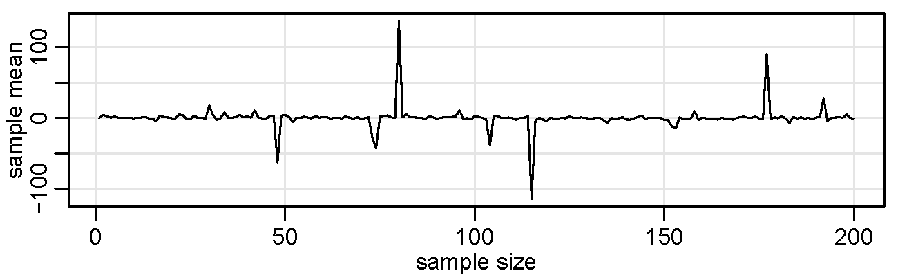
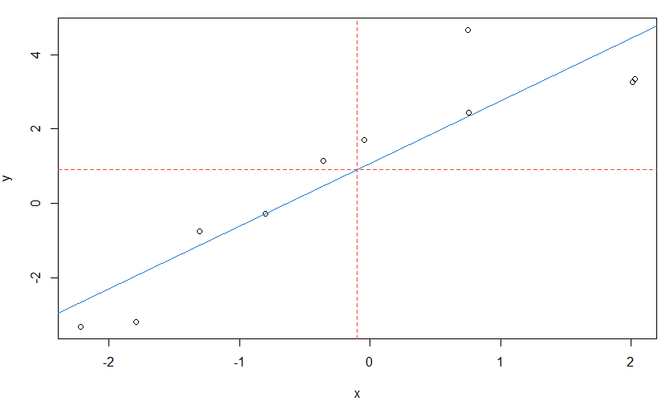

# R Tutorial 

---


_Appendectomy:_ This site replaces Appendix R in the texts _Time Series Analysis and Its Applications: With R Examples_ and _Time Series:  A Data Analysis Approach Using R_ both by Shumway & Stoffer

🔰 This tutorial is meant as a basic introduction for new R users. 🔰

&#128312; &#128312; &#128312; &#128312; &#128312;

### Table of Contents

  * [Installing R](#installing-r)
  * [Packages and ASTSA](#packages-and-astsa )
  * [Getting Help](#getting-help)
  * [Basics](#basics)
  * [Doing Stuff to Objects](#doing-stuff-to-objects)
  * [Lists & Structure](#lists--structure)
  * [Regression and Time Series Primer](#regression-and-time-series-primer)
  * [Graphics](#graphics)
  * [More on ASTSA](#more-on-astsa)
  * [R Code in Texts](#r-code-in-texts)
  * [R Time Series Issues](#r-time-series-issues)

<br/>

## Installing R
---

R is an open source statistical computing and graphics system that runs on many operating systems. It comes with a very minimal GUI (except for Linux) with which a user can type a command, press enter, and an answer is returned. In Linux, it runs in a terminal.


&#128018; To obtain R, point your browser to the Comprehensive R Archive Network ([CRAN](http://cran.r-project.org/)) and download and install it. The installation includes help files and some user   manuals.  An internet search  can pull up various short tutorials and  videos, for example, [R Cookbook](https://rc2e.com/), [Hands-On Programming with R](https://rstudio-education.github.io/hopr/)  and the website [Quick-R](https://www.statmethods.net/r-tutorial/index.html). And we state the obvious:

 > &nbsp;&nbsp;&nbsp;  _If you can't figure out how to do something, do an internet search_.

 &#128312; &#128312; &#128312; &#128312; &#128312; 

- [RStudio](https://posit.co/downloads/) is a more developed GUI and can make using R easier. We recommend that novices use it for course work.  There is a free version for Mac, Windows, and various Linux OSs. 

- Another viable (and free) option for multiple OSs is [VSCode](https://code.visualstudio.com) with the [R Extension](https://marketplace.visualstudio.com/items?itemName=REditorSupport.r).

- For multiple OSs, there's [Emacs](https://www.gnu.org/software/emacs/), and with the [ESS](https://ess.r-project.org) _Emacs Speaks Statistics_ add-on, you'll be crunching numbers in no time. (It's not a GUI. And here's some info for [vi](https://medium.com/free-code-camp/turning-vim-into-an-r-ide-cd9602e8c217) die hards). 

- For Windows, [Notepad++](https://notepad-plus-plus.org) along with [NpptoR](https://github.com/halpo/NppToR) works well, but it's not a GUI.  In Linux (with Snap) it installs easily:

```sh
sudo snap install notepad-plus-plus
```

Sorry, no notepad++ for Mac or Cheese &#127858;.


- There is also  [Tinn-R](https://tinn-r.org/en/) ... its existence is basically all we know- it looks like a Windows (only?) GUI application and it is free.

&#128312; &#128312; &#128312; &#128312; &#128312; 

<br/>


There are some simple exercises that will help you get used to using R. For example,

- __Exercise:__ Install R and any other interactive software (optional) now.  

- _Solution:_ Find the monkey &#128018; above and follow the directions.

<br/>

[<sub>top</sub>](#table-of-contents)

<br/>


## Packages and ASTSA 
---

At this point, you should have R up and running.

&#10067; Ready ...


The capabilities of R are extended through packages. R comes with  a number of preloaded packages that are available immediately. 

- There are (about 15) base packages that install with R and load automatically.  (e.g., `stats`)

- Then there are (about 15) priority packages that are installed with R but not loaded automatically.  (e.g., `nlme`)

- Finally, there are  user-created packages that must be installed (once) and then loaded into R before use.  (e.g., `astsa`)

Most packages can be obtained from CRAN and its mirrors.  The package used extensively in the text is `astsa` (Applied Statistical Time Series Analysis).   Get it now:

- __Exercise:__ Install  `astsa` 

- _Solution:_ Issue the command: `install.packages('astsa')` . If asked to choose a repository, select _0-Cloud_, the first choice, and that will find your closest repository. 

&#127381;  When `astsa` is loaded (as of version 2.3), the user is asked if they want to install the package `xts`.  It is beneficial to answer YES because we  use the  package  throughout the text.


 The latest version of `astsa`  will  always be  available from GitHub.  More information may be found at [ASTSA NEWS](https://github.com/nickpoison/astsa/blob/master/NEWS.md).    

Except for base packages, to use a package you have to load it after starting R, for example:
```r
library(astsa)
```

To suppress asking about loading `xts` you can use
```r
suppressPackageStartupMessages(library(astsa))
```
BUT the message is displayed only  if `xts` is not installed... so installing it is another way to avoid being asked.  And if you're doing time series analysis, `xts` is an important package.

You may want to create a `.First` function as follows, 
```r
.First <- function(){library(astsa)}
```
and save the workspace when you quit, then `astsa` will be loaded at every start.  Other startup commands can be added later. 


And again, to use the package `xts`, you must load it first by issuing the command 
```r
library(xts)
```


<br/>

&#128312;&#128312;&#128312;&#128312;&#128312;&#128312;&#128312;

&#9940; &#9940;  __WARNING:__  If you are focusing on data manipulation in a course or otherwise, and you are using `dplyr`, then this warning is for you.  

If loaded, the package `dplyr` may (and most likely will) corrupt the base scripts  `filter` and  `lag` from the  `stats` package that time series analysts use often. In this case, to avoid problems when analyzing time series, here are some options:

```r
(1) # either detach it if you don't need it
detach(package:dplyr)  

(2) # or fix it yourself if you want dplyr
# this is a great idea from  https://stackoverflow.com/a/65186251
library(dplyr, exclude = c("filter", "lag"))  # remove the culprits
dlag <- dplyr::lag            # and do what the dplyr ... 
dfilter <- dplyr::filter      # ... folks refuse to do
# and then use dlag and dfilter for the corresponding dplyr commands

(3) # or just take back the commands 
filter = stats::filter
lag = stats::lag

 # in this case, you can still use these for dplyr
 dlag <- dplyr::lag     
 dfilter <- dplyr::filter 
```

 &#128534;  If you are wondering how it is possible to corrupt a base package, &#128125; you are not alone. 

&#128312;&#128312;&#128312;&#128312;&#128312;&#128312;&#128312;

<br/>

## Getting Help
---

R is not consistent with help files across different operating systems except for the html system that can be started by issuing the command 

```r
help.start()
```

The help files for installed packages can also be found there.


&#10024;  _Notice the parentheses_ &#10024; in the commands above; they are necessary to run scripts. If you simply type

```r
help.start     
```
nothing will happen and you will just see the commands that make up the script.  Usually you include options in the parentheses, but some scripts like `help.start()` have defaults for everything, so no need to add stuff between `(` and `)`.


To get help for a particular command, say `library`,  do this:

```r
help(library) 
?library        # same thing    
```

- __Exercise:__  Load `astsa` and examine its help files.
- _Solution:_  `library(astsa)` ;  `?astsa` 

&#10024; Notice the use of a semicolon for multiple commands on one line. &#10024;

<br/>

&#10060; After viewing enough help files, you will eventually run into `## Not run:` in an __Examples__ section.  Why would an example be given with a warning NOT to run it?

> `Not run` just tells CRAN not to check the example for various reasons such as it takes a long time to run  ... it sort of runs against the idea that help files should be helpful or at least not make things worse.  _Bottom line: Ignore it. <font color="#FF4500">It is NOT for a user's consumption.</font>_  If you are using html help and you see this, then <font color="#38f">Run Examples</font> will not do anything. 


<br/>

Finally, you can find lots of help on the internet &#129300;.  If you have a specific and difficult question, try [Stack Overflow](https://stackoverflow.com/questions/tagged/r).  Before you ask a question, read [how to ask a good question](https://stackoverflow.com/help/how-to-ask).


<br/>

[<sub>top</sub>](#table-of-contents)

<br/>

## Basics 
---


The convention throughout the texts is that  R code is in <font color="#3366FF"> blue </font>  with <font color="red"> red </font> operators, output is <font color="purple">  purple </font>, and comments are <font color="green">green</font>.  This  does not apply to this site where syntax highlighting is controlled by your browser and GitHub. 

Get comfortable, start R and try some simple tasks.

```r
2+2           # addition, type 2 + 2 and then hit return
 [1] 5        # and you get an answer ([1] is the index of the number displayed)

5*5 + 2       # multiplication and addition 
 [1] 27

5/5 - 3       # division and subtraction 
 [1] -2

log(exp(pi))  # log, exponential, pi 
 [1] 3.141593

sin(pi/2)     # sinusoids
 [1] 1

2^(-2)        # power
 [1] 0.25 

2^20          # to the people right on
 [1] 1048576

sqrt(8)       # square root
 [1] 2.828427

-1:5           # sequences 
 [1] -1  0  1  2  3  4  5

seq(1, 10, by=2)   # sequences 
 [1] 1 3 5 7 9

rep(2, 3)      # repeat 2 three times
 [1] 2 2 2
  
6/2*(1+2)      # not one
 [1] 9  
```

- __Exercise:__  Explain what you get if you do this: `(1:20/10) %% 1`
- _Solution:_  Yes, there are a bunch of numbers that look like what is below, but explain why those are the numbers that were produced. Hint:  `help("%%")`  

```r
 [1] 0.1 0.2 0.3 0.4 0.5 0.6 0.7 0.8 0.9 0.0
[11] 0.1 0.2 0.3 0.4 0.5 0.6 0.7 0.8 0.9 0.0 
```

- __Exercise (extra credit):__  What is the next number in the sequence: 14, 23, 34, 50, __ ?
- _Solution:_  The answer is 59 because that's the next stop going uptown on the NYC Subway Eighth Avenue Line.


That was fun, but let's get a little more complex:

- __Exercise:__ Verify that $1/i = -i$ where $i = \sqrt{-1}$.
- _Solution:_  The complex number $i$ is written as `1i` in R.

```r
1/1i  
 [1] 0-1i    # complex numbers are displayed as a+bi
```


- __Exercise:__  Calculate $e^{i \pi}$.
- _Solution:_  `exp(1i*pi)`

&#127872; Extra credit: $e^{i \pi} + 1 =0$ is a famous formula that uses the five most basic values in mathematics.  Whose name is associated with this awesome equation? (Hint: It's not Will Hunting)

Ok, now try this.

- __Exercise:__  Calculate these four numbers: $ \cos(\pi/2),\, \cos(\pi),\, \cos(3\pi/2),\, \cos(2\pi)$
- _Solution:_   One of the advantages of R is you can do many things in one line. So  rather than doing this in four separate evaluations, consider using a sequence such  as `cos(pi*1:4/2)`. Notice that you don't always get zero (0) where you should, but you will get something close to zero.    Here  you'll see what it looks like.

<br/>

[<sub>top</sub>](#table-of-contents)

<br/>

## Doing Stuff to Objects 
---

You may have heard that R is object oriented. But aren't we all object oriented? ... I mean, we all like to own stuff. But, before we do stuff to objects,  let's first make some  objects using _assignment_:

```r
x <- 1 + 2  # put 1 + 2 in object x

x = 1 + 2   # same as above with fewer keystrokes

1 + 2 -> x  # same

x           # view object x
 [1]  3

(y = 9 * 3)   # put 9 times 3 in y and view the result 
 [1] 27

(z = rnorm(5))  # put 5 standard normals into z and print z
 [1]  0.96607946  1.98135811 -0.06064527  0.31028473  0.02046853
```

Vectors can be of various types, and they can be put together using `c()` [_concatenate_ or _combine_]; for example
```r
x <- c(1, 2, 3)             # numeric vector

y <- c("one","two","three") # character vector

z <- c(TRUE, TRUE, FALSE)   # logical vector
```

Missing values are represented by the symbol `NA`, $\infty$ by `Inf`, and undefined values  are `NaN` (not a number). Here are some examples:
```r
( x = c(0, 1, NA) )
 [1]  0  1 NA  

2*x
 [1]  0  2 NA  

is.na(x)
 [1] FALSE FALSE  TRUE  

x/0 
 [1] NaN Inf  NA  
```

There is a difference between `<-` and `=`.  From R  `help(assignOps)`, you will find: _The operator `<-` can be used anywhere, whereas the operator `=` is only allowed at the top level ... ._

- __Exercise:__  What is the difference between these two lines?

```r
x = 0 = y
x <- 0 -> y
```

- _Solution:_ Try them and discover what is in `x` and `y`. 

R loves arrows... most likely due to a fondness of Cupid, Robin Hood, or the Green Arrow. The problem is `<-` or `->` requires 3 key strokes (`-`, `[Shift]`, and `>` or `<` ... who has the time?).  

<br/>

Here's a thing about TRUE and FALSE &#129300;. `T` and `F` are initially set to `TRUE` and `FALSE`, so this works if you want object `AmInice` to be TRUE:

```r
AmInice = T
AmInice
 [1] TRUE
```

But this is bad practice because it can be easily wrecked, for example, if you set `T` to something else and then forget that you did .... :
```r
# ... work work work ...
T = 17  # ... somewhere in your work ...
# ... more work ...
# ... time for lunch ...
# ... eat lunch at your desk ...
# ... mustard on you lap ...
# ... go wash it off ...
# ... start working again ...
 ( AmInice = T )
 [1] 17
# ... oops- not TRUE any more ... unless the TRUTH is 17
```

__Moral:__ Get used to using the whole words  `TRUE` and `FALSE` and try not to use the `T` and `F` shortcuts. This is especially concerning because T and F are some of our favorite distributions.  Also, some editors have word completion, typing T might bring up TRUE, so the amount of typing is almost the same.

<br/>
&#128312;&#128312;&#128312;&#128312;&#128312;

&#9851; It is worth pointing out R's _recycling rule_ for doing arithmetic.  Note again the use of the semicolon for multiple commands on one line. 
```r
x = c(1, 2, 3, 4); y = c(2, 4); z = c(8, 3, 2)

x * y    
 [1]  2  8  6 16 

y + z    # oops
 [1] 10  7  4 
 Warning message:
 In y + z : longer object length is not a multiple of shorter object length
```

- __Exercise:__  Why was `y+z` above the vector (10, 7, 4) and why is there a warning?
- _Solution:_ `y + z = (2+8=10, 4+3=7, 2+2=4)`.  `y` is being recycled but not fully.   This type of calculation is usually done in error.


 The following  commands are useful:
```r 
ls()                # list all objects
 "dummy" "mydata" "x" "y" "z"

ls(pattern = "my")  # list every object that contains "my" 
 "dummy" "mydata"

rm(dummy)           # remove object "dummy"

rm(list=ls())       # remove almost everything (use with caution)

data()              # list of available data sets

help(ls)            # specific help (?ls is the same)

getwd()             # get working directory

setwd()             # change working directory

q()                 # end the session (keep reading)
```
and a [reference card may be found here](https://cran.r-project.org/doc/contrib/Short-refcard.pdf).

&#128312;&#128312;&#128312;&#128312;&#128312;


&#10024; __Ending a Session:__ When you quit, R will prompt you to save an image of your current workspace. Answering _yes_ will  save   the work  you have done so far, and load it when you next start R. We have never regretted selecting _yes_, but we have regretted answering _no_.

&#128054; It's not a big deal saving all your work because the information is stored in the working directory in a (hidden) file called .Rhistory, which is an ascii (text) file that can be edited with any text editor.  You can easily remove or keep anything you desire as long as you have the ability to see "hidden" files.  


&#10024; __Organization:__ If you want to keep your files separated for different projects, then having to set the working directory each time you run  R  is a pain.  If you use RStudio, then you can easily [create separate projects](https://support.posit.co/hc/en-us/articles/200526207).  There are some easy work-arounds, but it depends on your OS.  In Windows, copy the R shortcut into the directory you want to use for your project. Right click on the shortcut icon, select _Properties_, and remove the text in the _Start in:_ field; leave it blank and press _OK_.  Then start R from that shortcut (works for RStudio too).  


- __Exercise:__  Create a directory that you will use for the course and use the tricks previously mentioned to make it your working directory (or use the default if you   do not care). Load `astsa` and use help to find out what is in the data file `cpg`. Write `cpg` as text to your working directory.
- _Solution:_  Assuming you started R in the working directory:

```r
library(astsa)
help(cpg)     # or ?cpg
 #  Median annual cost per gigabyte (GB) of storage. 
write(cpg, file="cpg.txt", ncolumns=1)   
```

- __Exercise:__ Find the file `cpg.txt` previously created (leave it there for now).
- _Solution:_ Go to your working directory: 

```r
getwd()
 [1] "/home/TimeSeries" 
```
Now find the file and  look at it... there should be 29 numbers in one column.


To create your own data set, you can make a data vector as follows:
```r
mydata = c(1,2,3,2,1)
```

Now you have an object called `mydata` that contains five elements.  R calls these objects `vectors` even though they have no dimensions (no rows, no columns); they do  have order and length:

```r
mydata         # display the data 
 [1] 1 2 3 2 1

mydata[3:5]    # elements three through five 
 [1] 3 2 1

mydata[-(1:2)] # everything except the first two elements
 [1] 3 2 1

length(mydata) # number of elements
 [1] 5

scale(mydata)  # standardize the vector of observations
            [,1]
 [1,] -0.9561829
 [2,]  0.2390457
 [3,]  1.4342743
 [4,]  0.2390457
 [5,] -0.9561829
 attr(,"scaled:center")
 [1] 1.8
 attr(,"scaled:scale")
 [1] 0.83666 

dim(mydata)    # no dimensions
 NULL

mydata = as.matrix(mydata)  # make it a matrix

dim(mydata)    # now it has dimensions
 [1] 5 1
```


&#128312;&#128312;&#128312;&#128312;&#128312;

If you have an external data set, you can use `scan` or `read.table` (or some variant) to input the data. For example, suppose you have an ascii (text) data file called `dummy.txt` in your working directory, and the file looks like this:

`-----------`<br/>
`1 2 3 2 1` <br/>
`9 0 2 1 0`<br/>
`-----------`<br/>

 ```r
(dummy = scan("dummy.txt") )        # scan and view it
 Read 10 items
  [1] 1 2 3 2 1 9 0 2 1 0

(dummy = read.table("dummy.txt") )  # read and view it 
 V1 V2 V3 V4 V5
  1  2  3  2  1
  9  0  2  1  0
 ```
There is a difference between `scan` and `read.table`. The former produced a data vector of 10 items while the latter produced a _data frame_ with names `V1` to `V5` and two observations per variate. 


- __Exercise:__ Scan and view  the data in the file `cpg.txt` that you previously created. 
- _Solution:_ Hopefully it's in your working directory:

```r
(cost_per_gig = scan("cpg.txt") )  # read and view
  Read 29 items
  [1] 2.13e+05 2.95e+05 2.60e+05 1.75e+05 1.60e+05
  [6] 7.10e+04 6.00e+04 3.00e+04 3.60e+04 9.00e+03 
 [11] 7.00e+03 4.00e+03 ... 
```


When you use `read.table` or similar, you create a data frame. In this case, if you want to print or use the second variate, `V2`, you could use
 ```r 
dummy$V2
 [1] 2 0
 ```
and so on. You might want to look at the help files `?scan` and `?read.table` now. Data frames (`?data.frame`) are _used as the fundamental data structure by most of R's modeling software._ Notice that R gave the columns of `dummy`  generic names, `V1,..., V5`.  You can provide your own names and then use  the names to access the data without the use of `$` as   above.
 ```r 
colnames(dummy) = c("Dog", "Cat", "Rat", "Pig", "Man")

attach(dummy)    # this can cause problems; see ?attach

Cat              # view the vector Cat
  [1] 2 0 

Rat*(Pig - Man)  # animal arithmetic  
  [1] 3 2 

head(dummy)      # view the first few lines of a data file

detach(dummy)    # clean up  
 ```

R is case sensitive, thus `cat` and `Cat` are different.  Also, `cat` is a reserved name (`?cat`), so using `cat` instead of `Cat` may  cause problems later. It is noted that `attach` can lead to problems: _The possibilities for creating errors when using attach are numerous. Avoid._  If you use it, it is best to clean it up when you are done.

You can also use `save` and `load` to work with R compressed data files if you have large files. If interested, investigate the use of the `save` and `load` commands. The best way to do this is to do an internet search on _R save and load_, but you knew this already.


You may also include a _header_ in the data file to avoid `colnames`. For example, if you have a _comma separated values_ file `dummy.csv`   that looks like this,<br/>

`--------------------------`<br/>
`Dog, Cat, Rat, Pig, Man`<br/>
`1, 2, 3, 2, 1` <br/>
`9, 0, 2, 1, 0` <br/>
`--------------------------`<br/>


then use the following command to read the data.
 ```r 
(dummy = read.csv("dummy.csv")) 
     Dog Cat Rat Pig Man
   1   1   2   3   2   1
   2   9   0   2   1   0
 ```

The default for `.csv` files is `header=TRUE`, type  `?read.table` for further information   on similar types of files.


Two commands that are used frequently to manipulate data are `cbind` for _column binding_ and `rbind` for _row binding_. The following is an example.

```r
options(digits=2)  # significant digits to print - default is 7

x = runif(4)       # generate 4 values from uniform(0,1) into object x

y = runif(4)       # generate 4 more and put them into object y

cbind(x,y)         # column bind the two vectors (4 by 2 matrix) 
          x    y
  [1,] 0.90 0.72
  [2,] 0.71 0.34
  [3,] 0.94 0.90
  [4,] 0.55 0.95

rbind(x,y)         # row bind the two vectors (2 by 4 matrix)
    [,1] [,2] [,3] [,4]
  x 0.90 0.71 0.94 0.55
  y 0.72 0.34 0.90 0.95
```

- __Exercise:__ Make two vectors, say `a` with odd numbers  and `b` with even numbers between 1 and 10.  Then, use `cbind` to make a matrix,  `x` from  `a` and `b`. After that, display each column of `x` separately.
- _Solution:_


```r
a = seq(1, 10, by=2)

b = seq(2, 10, by=2)

x = cbind(a, b)

x[,1]
 [1] 1 3 5 7 9 

x[,2]
 [1]  2  4  6  8 10 
```


Summary statistics of a data set are fairly easy to obtain.  We will simulate 25 normals with $\mu=10$ and $\sigma=4$ and then perform some basic analyses. The first line of the code is `set.seed`, which fixes the seed for the generation of pseudorandom  numbers. Using the same seed yields the same results; to expect anything else would be insanity.

```r
options(digits=3)       # output control 

set.seed(911)           # so you can reproduce these results

x = rnorm(25, 10, 4)    # generate the data

summary(x)
  Min. 1st Qu.  Median    Mean 3rd Qu.    Max. 
  4.46    7.58   11.47   11.35   13.69   21.36 

c( mean(x), median(x), var(x), sd(x) )  # guess
 [1] 11.35 11.47 19.07  4.37

c( min(x), max(x) )     # smallest and largest values
 [1] 4.46 21.36 

which.max(x)            # index of the max (x[20] in this case) 
 [1] 20 

boxplot(x);  hist(x);  stem(x)   # visual summaries (not shown)
```


- __Exercise:__ Generate 100 standard normals and draw a boxplot of the results when there are at least two displayed "outliers'' (keep trying until you get at least two).

- _Solution:_ Even without cheating, it will not take long to complete:


```r
set.seed(911)        # you can cheat -or-
boxplot(rnorm(100))  # reissue until you see at least 2 outliers
```

&#127817; Extra Credit: When is an outlier not an outlier?   Answer forthcoming.


&#128312;&#128312;&#128312;&#128312;&#128312;


It can't hurt to learn a little about programming in R because you will see some of it along the way. First, let's try a simple example of a function that returns the reciprocal of a number:
```r
oneover <- function(x){ 1/x }

oneover(0)
 [1] Inf 

oneover(-4)
 [1] -0.25      
```

A script can have multiple inputs, for example, guess what this does:
```r
xtimesy <- function(x, y){ x * y }    
xtimesy(20, .5)  # and try it
  [1] 10 
```

- __Exercise:__  Write a simple function to return, for numbers `x` and `y`, the first input raised to the power of the second input, and then use it to find the square root of 25.
- _Solution:_ It's similar to the previous example.

```r
pwr <- function(x, y){ x^y }  

# now use it
pwr(25, .5)  
  [1] 5  
```

Finally, consider a simple program that we will call `crazy` to produce a graph of a sequence of sample means of increasing sample sizes from a Cauchy distribution with location parameter zero.

```r
crazy <- function(num) {   # start the script - 1 argument, num, is final sample size
  x <- c()                 # start a vector in object x
  for (n in 1:num) { x[n] <- mean(rcauchy(n)) }  # x[n] holds mean of n standard Cauchys
  plot(x, type="l", xlab="sample size", ylab="sample mean") # plot mean for each sample size n
  }                        # end/close the script

set.seed(1001)   # set a seed (not necessary) and
crazy(200)       # run it - plot below
```

<br/>

<br/>

[<sub>top</sub>](#table-of-contents)

<br/>

## Lists & Structure
---

Lists are useful objects that are an ordered collection of various components.  Often, an R script will  output a list that is returned invisibly (you don't see the output unless you go get it).  

Let's start by making a simple list so you can see how they work.
```r
mylist = list(x=rnorm(10), y=runif(5), stoogi=c('Mary', 'Ma', 'Curly') )

# look at it
mylist

  $x
   [1]  0.57897116 -1.01315589  1.54542300  0.04080964  0.91642233 -1.96527510
   [7]  1.67927692 -0.26268298  0.18003714  0.34976816

  $y
  [1] 0.3865887 0.5310180 0.7585465 0.1735883 0.6125359
  
  $stoogi
  [1] "Mary"  "Ma"    "Curly"
```

There are a couple of ways to get at the objects in a list.  For example, if you need `y`:
```r
mylist$y
  [1] 0.3865887 0.5310180 0.7585465 0.1735883 0.6125359
# - OR -
mylist[[2]]
# - OR -
mylist[['y']]  
```

 - __Exercise:__ How would you display the names of the stoogi? 
- _Solution:_   `mylist[[3]]` or `mylist$stoogi` or `mylist[['stoogi']]`

When dealing with output, and especially lists that are returned invisibly, your friend is the structure command (`str`) ... it will display a summary of an object, and it looks like this:

```r
str(mylist)

  List of 3
   $ x     : num [1:10] 0.579 -1.0132 1.5454 0.0408 0.9164 ...
   $ y     : num [1:5] 0.387 0.531 0.759 0.174 0.613
   $ stoogi: chr [1:3] "Mary" "Ma" "Curly"
```

 - __Exercise:__ Make a boxplot of some random numbers and find out what is returned invisibly with the graphic.
- _Solution:_  below &#10549;

```r
deez = boxplot(rnorm(100))  # you just see a boxplot ... now what else is there?
str(deez)     # and invisibly, you get a list of 6 objects

  List of 6
   $ stats: num [1:5, 1] -2.267 -0.695 -0.166 0.412 1.993
   $ n    : num 100
   $ conf : num [1:2, 1] -0.34042 0.00932
   $ out  : num [1:2] 2.65 2.33
   $ group: num [1:2] 1 1
   $ names: chr "1"   
```

- __Exercise:__ What are in those objects `deez[[1]]` thru `deez[[6]]`?
- _Solution:_  I don't know, but if you look at the help file `?boxplot`, go down to the _Value_ section, you'll see what they are.  For example, 

`  stats`: ` a matrix, each column contains the extreme of the lower whisker,  ...`

<br/>

Note that if a script returns results invisibly, you have to &#127881; NAME THAT OBJECT &#127881;.  For example, if you just type &#128532;
`boxplot(x)` 
 you'll just see the boxplot and you won't have the other returned stuff to play with. If you want to use or see the other stuff, you have to do something like &#128526;
 `nuts <- boxplot(x)` 
 so you can see the boxplot and then get all the other stuff from `nuts`.

<br/>

[<sub>top</sub>](#table-of-contents)

<br/>

## Regression and Time Series Primer
---

First things first, TURN OFF THOSE LOUSY SIGNIFICANCE STARS:

```r
options(show.signif.stars=FALSE)
```

These topics run throughout the text, but we will give a brief introduction here. The workhorse for linear regression in R is `lm()`.  Suppose we want to fit a simple linear regression, $y = \alpha + \beta x + \epsilon$.  In R, the formula is written as `y~x`. Let's simulate some data and do a simple example first.

```r
set.seed(666)           # not that 666       

x = rnorm(10)           # generate 10 standard normals  

y = 1 + 2*x + rnorm(10) # generate a simple linear model

summary(fit <- lm(y~x)) # fit the model - summarize results
   Coefficients:
              Estimate Std. Error t value Pr(>|t|)    
  (Intercept)   1.0680     0.3741   2.855 0.021315    
  x             1.6778     0.2651   6.330 0.000225  
  ---
  Residual standard error: 1.18 on 8 degrees of freedom
  Multiple R-squared:  0.8336,    Adjusted R-squared:  0.8128 
  F-statistic: 40.07 on 1 and 8 DF,  p-value: 0.0002254

plot(x, y)              # scatterplot of data (see below)

abline(fit, col=4)      # add fitted blue line (col 4) to the plot  
```

Note that we put the results  into an  object we called `fit`; this list object contains all of the information about the  regression.   Then we used `summary` to display some of the results   and used `abline` to plot the fitted line. The command `abline` is useful for drawing horizontal and vertical lines also.

 - __Exercise:__ Add red horizontal and vertical dashed lines to the previously generated graph to show that the fitted line goes through the point $(\bar x, \bar y)$.
- _Solution:_  Add the following line to the above code:

```r 
abline(v=mean(x), h=mean(y), col=2, lty=2)  # col 2 is red and lty 2 is dashed
```



<br/>


The `lm` object that we called `fit` in  our simulation contains all sorts of information that can be extracted.  Recall that one way to find what is stored in an object is to look at the _structure_ of the object.  We give partial output because this particular list is very long.

```r
str(fit)     # partial listing below
  List of 12  
   $ coefficients : Named num [1:2] 1.07 1.68
    ..- attr(*, "names")= chr [1:2] "(Intercept)" "x"
   $ residuals    : Named num [1:10] 2.325 -1.189 0.682 -1.135 -0.648 ...
    ..- attr(*, "names")= chr [1:10] "1" "2" "3" "4" ...
   $ fitted.values: Named num [1:10] 2.332 4.448 0.472 4.471 -2.651 ...
    ..- attr(*, "names")= chr [1:10] "1" "2" "3" "4" ...
```

Notice `fit` is a list of 12 items, `fit[[1]]` to `fit[[12]]`. For example, the parameter estimates are in `fit[[1]]` or `fit$coef` or `coef(fit)`. We can get the residuals from `fit[[2]]` or`fit$resid` or `resid(fit)`, and   `fit[[3]]` or `fit$fitted` or `fitted(fit)` will display the fitted values.  For example, we may be interested in plotting the residuals in order or in  plotting the residuals against the fitted values:

```r 
plot(resid(fit))              # not shown

plot(fitted(fit), resid(fit)) # not shown
```

<br/>

In multiple regression, for example $y = \beta_0 + \beta_1 x_1 + \beta_2 x_2 + \epsilon$, the syntax are `fit <- lm(y~ x1 + x2)` and so on.   For example, 

```r
fit = lm( mpg~ cyl + disp + hp + drat + wt + qsec, data=mtcars) 
ttable(fit, vif=TRUE)  # 'ttable' in astsa, which has to be loaded first

## output

  Coefficients:
              Estimate      SE  t.value  p.value       VIF
  (Intercept)  26.3074 14.6299   1.7982   0.0842          
  cyl          -0.8186  0.8116  -1.0086   0.3228    9.9590
  disp          0.0132  0.0120   1.0971   0.2831   10.5506
  hp           -0.0179  0.0155  -1.1564   0.2585    5.3578
  drat          1.3204  1.4795   0.8925   0.3806    2.9665
  wt           -4.1908  1.2579  -3.3316   0.0027    7.1817
  qsec          0.4015  0.5166   0.7771   0.4444    4.0397

 Residual standard error: 2.557 on 25 degrees of freedom
 Multiple R-squared:  0.8548,    Adjusted R-squared:   0.82 
 F-statistic: 24.53 on 6 and 25 DF,  p-value: 2.45e-09
 AIC =  3.1309    AICc =  3.2768    BIC =  3.4974 
```

`mtcars` is an R data set of gas consumption (`mpg`) and various car design aspects. The design aspects are  related, thus the high VIFs.  Also notice that the engine size (`disp`) coefficient has the wrong sign because bigger engines don't get better gas mileage.  Also, nothing but weight (`wt`) is significant because the SEs are inflated.

<br/>
&#128312;&#128312;&#128312;&#128312;&#128312;

## Time Series
---

Let's  focus a little on time series. To create a time series object, use the command `ts`.  Related commands are `as.ts` to coerce an object to a time series  and `is.ts` to test whether an object is a time series.  First, make a small data set:

```r
(mydata = c(1,2,3,2,1) ) # make it and view it
  [1] 1 2 3 2 1
```

Make it an annual time series that starts in 2020:

```r 
(mydata = ts(mydata, start=2020) )
  Time Series:
  Start = 2020
  End = 2024
  Frequency = 1
  [1] 1 2 3 2 1 
```

Now make it a quarterly time series that starts in 2020-III:
```r 
(mydata = ts(mydata, start=c(2020,3), frequency=4) )
       Qtr1 Qtr2 Qtr3 Qtr4
  2020              1    2
  2021    3    2    1     

time(mydata)  # view the dates  
          Qtr1    Qtr2    Qtr3    Qtr4 
  2020                 2020.50 2020.75
  2021 2021.00 2021.25 2021.50 
```

To use part of a time series object,  use `window()`:
```r
( x = window(mydata, start=c(2021,1), end=c(2021,3)) )
       Qtr1 Qtr2 Qtr3
  2021    3    2    1
```

Next, we'll look at lagging and differencing, which are fundamental transformations used frequently in the analysis of time series. For example, if I'm interested in predicting todays from yesterdays, I would look at the relationship between $x_t$ and its lag, $x_{t-1}$.  

Now let's make a simple series $x_t$

```r
x = ts(1:5)
```

Then, column bind (`cbind`) lagged values of $x_t$ and you will notice that `lag(x)` is _forward_ lag, whereas `lag(x, -1)` is _backward_ lag.
```r
cbind(x, lag(x), lag(x,-1))
       x   lag(x)   lag(x, -1)
  0   NA      1        NA
  1    1      2        NA
  2    2      3         1
  3    3      4         2  <- # in this row, for example, x is 3, 
  4    4      5         3     #  lag(x) is ahead at 4, and  
  5    5     NA         4     #   lag(x,-1) is behind at 2  
  6   NA     NA         5 
```

Compare `cbind` and `ts.intersect`:

```r
ts.intersect(x, lag(x,1), lag(x,-1)) 
  Time Series:  Start = 2  End = 4  Frequency = 1
      x   lag(x, 1)   lag(x, -1)
  2   2         3          1
  3   3         4          2
  4   4         5          3
```

&#127982; When using lagged values of various series, it is usually necessary to use `ts.intersect` to align them by time.  You will see this play out as you work through the text.

To examine the time series attributes of an object, use `tsp`.  For example, one of the time series in `astsa` is the US unemployment rate:

```r
tsp(UnempRate)
 [1] 1948.000 2016.833   12.000
#    start    end        frequency
```

which starts January 1948, ends in November 2016 (10/12 &approx; .833), and is monthly data (frequency = 12).


For discrete-time series, finite  differences are used like differentials. To  difference a series, $\nabla x_t = x_t - x_{t-1}$, use
```r
diff(x)    
```
but note that
```r 
diff(x, 2)    
```
is $x_t - x_{t-2}$ and _not_ second order differencing. For second-order differencing, that is, $\nabla^2 x_t = \nabla (\nabla x_t)$, do one of these:
```r
diff(diff(x))

diff(x, diff=2)   # same thing
```
and so on for higher-order differencing.


&#128178; You have to be careful if you  use `lm()` for lagged values of a time series.  If you use `lm()`, then what you have to do is align the series using `ts.intersect`.    Please read the warning _Using time series_ in the `lm()` help file [`help(lm)`]. Here is an example regressing `astsa` data, weekly cardiovascular mortality ($M_t$ `cmort`) on particulate pollution ($P_t$ `part`) at the present value and lagged four weeks ($P_{t-4}$ `part4`). The model is

$$M_t = \alpha + \beta_1 P_t + \beta_2 P_{t-4} + w_t\,, $$

where we assume $w_t$ is the usual normal regression error term. First, we create the data frame  `ded`, which consists of the intersection of the three series:
 ```r
library(astsa)   # load astsa first

ded = ts.intersect(cmort, part, part4=lag(part,-4), dframe=TRUE)
 ```
Now the series are all aligned and the regression will work. We use `ttable` from `astsa`... 

```r
ttable(fit <- lm(cmort ~ part + part4, data = ded, na.action = NULL) )

     Coefficients:
                 Estimate      SE  t.value  p.value
     (Intercept)  69.0102   1.375  50.1899        0
     part          0.1514   0.029   5.2251        0
     part4         0.2630   0.029   9.0709        0
     
     Residual standard error: 8.323 on 501 degrees of freedom
     Multiple R-squared:  0.3091,    Adjusted R-squared:  0.3063 
     F-statistic: 112.1 on 2 and 501 DF,  p-value: < 2.2e-16
     AIC =  5.2478    AICc =  5.2479    BIC =  5.2814
```

There was no need to rename `lag(part,-4)` to `part4`, it's just an example of what you can do. Also,   `na.action=NULL` is necessary to retain the time series attributes. It should be there whenever you  do time series regression.


 - __Exercise:__ Rerun the previous example of mortality on pollution but without using `ts.intersect`.  
 - _Solution:_  First lag particulates and then put it in to the regression. In this case, the lagged pollution value gets kicked out of the regression because `lm()` sees `part` and `part4` as the same thing.

```r
part4 <- lag(part, -4)

ttable(fit <- lm(cmort~ part + part4, na.action=NULL) )  # ttable from astsa

     Coefficients: (1 not defined because of singularities)
                 Estimate      SE  t.value  p.value
     (Intercept)  74.7986  1.3094  57.1229        0
     part          0.2932  0.0263  11.1424        0
     part4             NA      NA       NA       NA
     
     Residual standard error: 8.969 on 506 degrees of freedom
     Multiple R-squared:  0.197,     Adjusted R-squared:  0.1954 
     F-statistic: 124.2 on 1 and 506 DF,  p-value: < 2.2e-16
      
     Warning: Due to perfect multicollinearity, at least 
     one variable has been kicked out of the regression. 
     Consider changing the model and trying again. 
```

An alternative to the above is the package `dynlm`, which has to be installed.  After the package is installed, you can do the previous example as follows:
 ```r
library(dynlm)                           # load the package

fit = dynlm(cmort ~ part + L(part,4))    # ts.intersect not needed

ttable(fit)           

     Coefficients:
                 Estimate      SE  t.value  p.value
     (Intercept)  69.0102   1.375  50.1899        0
     part          0.1514   0.029   5.2251        0
     L(part, 4)    0.2630   0.029   9.0709        0
     
     Residual standard error: 8.323 on 501 degrees of freedom
     Multiple R-squared:  0.3091,    Adjusted R-squared:  0.3063 
     F-statistic: 112.1 on 2 and 501 DF,  p-value: < 2.2e-16
     AIC =  5.2478    AICc =  5.2479    BIC =  5.2814 
 ```

In Chapter 1 problems, you are asked to fit a regression  model 
$$ x_t = \beta t + \alpha_1 Q_1(t) + \alpha_2 Q_2(t) + \alpha_3 Q_3(t) + \alpha_4 Q_4(t) +  w_t $$ 
where $x_t$ is  logged Johnson & Johnson quarterly earnings ($n=84$), and $Q_i(t)$ is the indicator of quarter $i=1,2,3,4$. The indicators can be made using `factor`.

 ```r
trend = time(jj) - 1970        # helps to 'center' time
Q     = factor(cycle(jj))      # make (Q)uarter factors
reg   = lm(log(jj) ~ 0 + trend + Q, na.action = NULL)  # 0 = no intercept

ttable(reg)                    

     Coefficients:
           Estimate      SE  t.value  p.value
     trend   0.1672  0.0023  73.9990        0
     Q1      1.0528  0.0274  38.4804        0
     Q2      1.0809  0.0274  39.4999        0
     Q3      1.1510  0.0274  42.0350        0
     Q4      0.8823  0.0274  32.1858        0

     Residual standard error: 0.1254 on 79 degrees of freedom
     Multiple R-squared:  0.9935,    Adjusted R-squared:  0.9931 
     F-statistic:  2407 on 5 and 79 DF,  p-value: < 2.2e-16
     AIC =  -3.0714    AICc =  -3.0622    BIC =  -2.8978

model.matrix(reg)              # view the model design matrix

          trend Q1 Q2 Q3 Q4
     1  -10.00  1  0  0  0
     2   -9.75  0  1  0  0
     3   -9.50  0  0  1  0
     4   -9.25  0  0  0  1
     5   -9.00  1  0  0  0
     .     .    .  .  .  .
     .     .    .  .  .  .

 ```

<br/><br/>

&#127792;&#127792;&#127792;&#127792;&#127792;

That's it for now.  You may want to check out the links below for other information.


&#127792;&#127792;&#127792;&#127792;&#127792;


<br/>

[<sub>top</sub>](#table-of-contents)

<br/>

## Graphics
---

- Graphics has its own page:   [Time Series and R Graphics](https://nickpoison.github.io/tsgraph.html)


<br/>


## More on ASTSA
---

- Fun with ASTSA has its own page: [FUN WITH ASTSA](https://github.com/nickpoison/astsa/blob/master/fun_with_astsa/fun_with_astsa.md)

<br/>

## R Code in Texts
---


-  Code in [Time Series Analysis and Its Applications (Ed 5)](https://github.com/nickpoison/tsa5/blob/master/textRcode.md)

- Code in [Time Series: A Data Analysis Approach Using R (Ed 2)](https://github.com/nickpoison/tsda2/blob/main/Rcode.md)

<br/>


## R Time Series Issues
---

- R Issues has its own page: [R Time Series Issues](https://nickpoison.github.io/rissues.html)

<br/>

[<sub>top</sub>](#table-of-contents)


<br/><br/><br/><br/><br/>


---
<p style="text-align: center;">&#128018; &Eopf; &#8469; &#120123; &#128018;</p>

